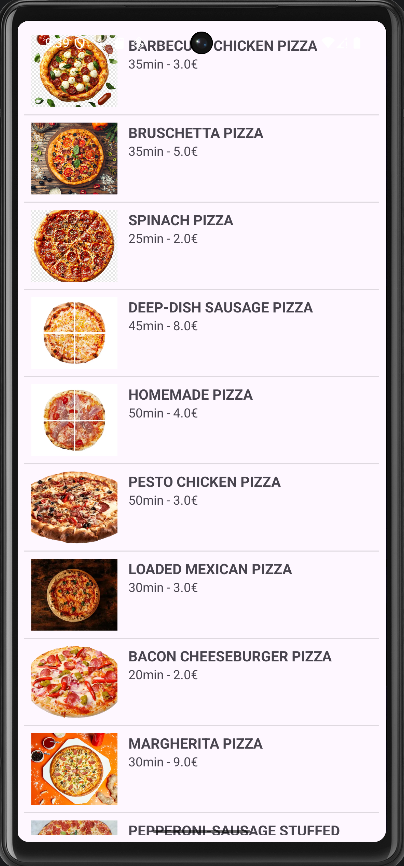
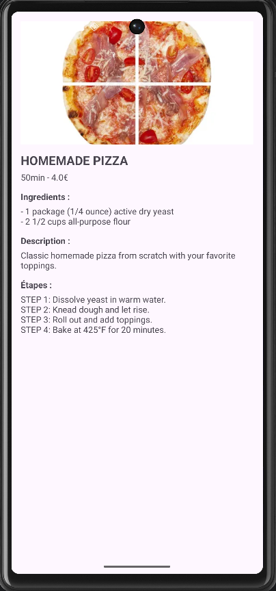

# 🍕 PizzaRecipes - Android App

 

A simple Android app to browse pizza recipes built with Java.

## ✨ Features
- Splash screen with animation
- List of pizzas with images, price & prep time
- Detailed view with ingredients, description & steps
- Clean architecture (DAO, Service, Adapter, UI)

## 🛠️ Tech Stack
- Java
- Android SDK (API 24+)
- ListView + Custom Adapter
- Singleton pattern for data service

## 🚀 How to run
1. Clone this repo
2. Open in Android Studio
3. Run on emulator or device

## 📂 Project Structure